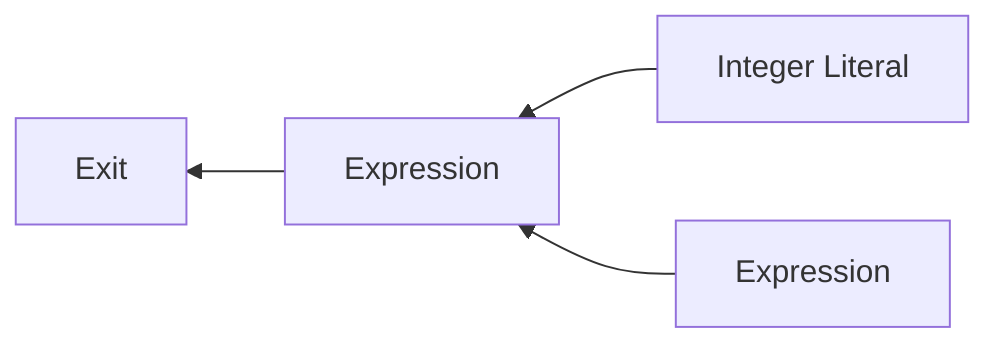
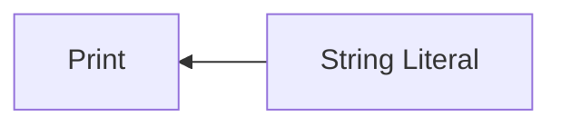

# Grammar

## Exit keyword

exit -> expression

expression -> expression : int_literal

```mermaid
graph RL
    EXIT[Exit]
    EXPRESSION_1[Expression]
    EXPRESSION_2[Expression]
    INT_LIT[Integer Literal]

    INT_LIT --> EXPRESSION_1
    EXPRESSION_2 --> EXPRESSION_1
    EXPRESSION_1 --> EXIT
```

## Print keyword

print -> string_literal

```mermaid
graph RL
    PRINT[Print]
    STR_LIT[String Literal]
    
    STR_LIT --> PRINT
```